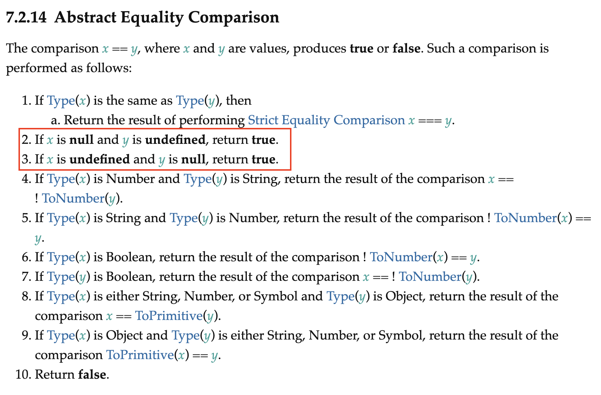

# Equality

## Double & Triple Equals

I wanna dig specifically into some issues about the == versus ===, since this is really the place where most people focus their attention when they talk about coercion.

The difference really changes our perspective on the utility, the purpose of these two mechanisms in our language. **So, I really think that if you're trying to understand your code, it's critical that you learn to think like JavaScript,** that's sort of been the thesis going along.

`==` checks value(loose) ⇒ [Abstract Equality Comparison](https://262.ecma-international.org/9.0/#sec-abstract-equality-comparison)

`===` checks value and type(strict) ⇒  [Strict Equality Comparison](https://262.ecma-international.org/9.0/#sec-strict-equality-comparison)

In both cases, they are equal. Because it turns out that when the types match, then they do the ===. **The double equals and the triple equals are exactly identical when the types match**. There is absolutely no difference. And the spec says so. When the types match, do the triple equals.

So I wouldn't write a function that could take null, undefined string, number, object, array, and 14 other types, and then all compare them with a ==, that's ludicy, right? But I would write a function that could take strings and numbers and compare them with a ==. Because there's a very **known and small subset of potential corner cases to work around.**

```jsx
var studentName1 = "Frank";
var studentName2 = `${studentName1}`;

var workshopEnrollment1 = 16;
var workshopEnrollment2 = workshopEnrollment1 + 0;

studentName == studentname2; 
studentName1 === studentName2;

workshopEnrollment1 == workshopEnrollment2;
workshopEnrollment1 === workshopEnrollment2
```

```jsx
var workshop1 = {
  name: "Deep JS Foundations"
};

var workshop2 = {
  name: "Deep JS Foundations"
};

workshop1 == workshop2;
workshop1 === workshop2;

//NaN / 0, -0
```

the == is going to allow coercion when the types were different. And the === is going to disallow coercion when the types are the same.

`==` allows coercion (types different)
`===` disallows coercion (types same)

## Coersive Equality

Essentially **the decision about double equals and triple equals is a trailing indicator of whether you actually understand your program**. Let me say that again.



`null == undefined`

```jsx
var workshop1 = { topic: null };
var workshop2 = {};

console.log(
  (workshop1.topic === null || workshop1.topic === undefined) && 
  (workshop2.topic === null || workshop2.topic === undefined)
); 

console.log(workshop1.topic == null && workshop2.topic == null);
```

[https://chat.openai.com/share/7cc4d01c-4d81-4547-87ce-4402bdd8fa52](https://chat.openai.com/share/7cc4d01c-4d81-4547-87ce-4402bdd8fa52)

When using the **`==`** operator for comparison in JavaScript, a process called **type coercion** takes place. Type coercion is the automatic conversion of values from one type to another in order to perform the comparison. In the case of **`null`** and **`undefined`**, they are both considered "falsy" values in JavaScript, meaning they are treated as false in a boolean context.

During the comparison **`null == undefined`**, both **`null`** and **`undefined`** are coerced to a common type, and since **they are both falsy value**s, the result is **`true`**.

## Double Equals Algorithm

this algorithm prefers to do **numeric comparison**.

Just knowing in the back of your head double equals prefers numeric comparison. **That one fact separates you from 99.99% of all JavaScript developers, cuz they've never even read the spec**.


```jsx
var workshop2Elem = { value: '16' };

var workshopEnrollment1 = 16;
var workshopEnrollment2 = workshop2Elem.value

console.log(Number(workshopEnrollment1) === Number(workshopEnrollment2));
console.log(workshopEnrollment1 == workshopEnrollment2);
```

## Double Equals Walkthrough


This is one of those clear examples I think where **coercion is a very bad thing for us.**

Okay, most important take-away here, the fix here is not to use triple equals. Triple equals prevents you from seeing the real problem, which is that you're making a terrible comparison in the first place.

Double equals isn't the one that's at fault. **And triple equals only covers it up, it doesn't fix the real problem**. If you make sensible comparisons, like a string representation of a number to the actual number, that's a sensible comparison and coercion makes complete sense there. **But if you compare something to something entirely different and it accidentally works, that's not sensible.**

That's not reasonable. I agree with you that the outcome that we see is, why would you do that? But what I don't tend to do is say JavaScript was poorly designed here. There are **historical reasons for why it allowed even the two primitives in a comparison**. If I were designing the coercion, I would of done all the other coercions but not included the two primitives, because in my opinion the only kind of non-primitive comparison that should ever be possible is the identity comparison.

Coercion with primitives is crazy. But one of the historical reasons for the coercion with primitives is that in **the olden days you did newString**, and now you have an object. But you don't think of it as being an object, you think of it as being the primitive. So they allowed that non-primitive to coercively down coerce itself to its primitive equivalent.
That's why the algorithm has something like that. I wouldn't write that code, but that's why it's there. So it's hard to say that's a poor design, in my opinion.

```jsx
var workshop1Count = 42;
var workshop2Count = [42];

console.log(workshop1Count == workshop2Count);
```

- Process
    
    ```jsx
    // workshop1Count == workshop2Count
    // 42 == '42'
    // 42 === 42
    ```
    

## Double Equals Summary

**If the types are the same: ===
If null or undefined: equal
If non-primitives: ToPrimitive
Prefer: ToNumber**

## Double Equality Conner Cases

```jsx
console.log([] == ![]);

var workshop1Student = [];
var workshop2Student = [];

console.log(workshop1Student == !workshop2Student);
console.log(workshop1Student != workshop2Student);
```

- Process
    
    ```jsx
    var workshop1Students = [];
    var workshop2Students = [];
    // if (workshop1Students == !workshop2Students) {
    // if ([] == false) {
    // if ("' == false) {
    // if (0 == false) {
    // if (0 === 0) {
    if (true) {
    // Yep, WAT!?
    }
    // if (workshop1Students != workshop2Students) {
    // if (!(workshop1Students == workshop2Students) ) {
    // if (!false) {
    if (true) {
    // Yep, WAT!?
    }
    ```
    

## Corner Cases: Boolean

There's one way of doing it, which is just just to do an **if statement**. Allow the if statement to invoke the to Boolean operation on the array, which, in this case, is a lookup that says the array is not on the table, so, therefore, it's true. **That's a perfectly rational implicit to Boolean coercion**.

```jsx
var workshopStudents = [];
console.log(Boolean(workshopStudents))

console.log(workshopStudents == true)

console.log(workshopStudents == false)
```

- Process
    
    ```jsx
    // if (workshopStudents) {
    // if (Boolean(CorkshopStudents)) {
    
    // if (workshopStudents == true) {
    // if ('' == true) {
    // if(0 === 1) 
    // if(false)
    // 
    
    // if (workshopStudents == false) {
    // if('' == false) {
    // ifs(0 === 0)
    // if (true)
    ```
    

## Corner cases

### Avoid:

1. `==` with `0` or `""` (or even `" "`)
2. `==` with non-primitives
3. `== true` or `== false` : allow `ToBoolean` or use `===`

### The case for preferring `==`

Knowing types is always better than not knowing them
Static Types is not the only (or even necessarily best) way to know your types

`==` is not about comparisons with unknown types
`==` is about comparisons with known type(s), optionally where conversions are helpful


#### If you know the type(s) in a comparison:

Summary: whether the types match or not, `==` is the more sensible choice

#### If you don't know the type(s) in a comparison:

Summary: if you can't or won't use known and obvious types, `===` is the only reasonable choice

Summary: 
making types known and obvious leads to better code. 
If types are known, `==` is best.
Otherwise, fall back to `===`.
